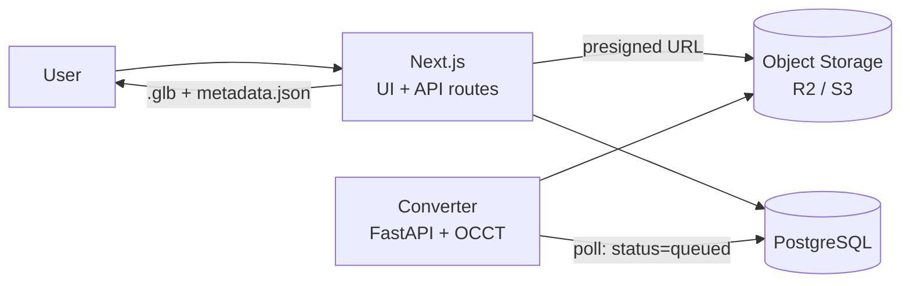

# Architecture

[Türkçe](ARCHITECTURE.md) · **English**

A web based CAD model management platform. The focus is on **detailed,
CAD-quality 3D inspection** of uploaded models in the browser; file sharing and
the catalogue exist to support that.

This document targets an MVP built by a single developer in roughly one month.

---

## 1. Core design decision

The hard part of this project is not upload, listing or comments — it is
**rendering a B-rep CAD file such as STEP meaningfully in a browser**. The
architecture is therefore built around a **conversion (tessellation) service**.

Two options were considered:

| Approach | Pros | Cons |
|---|---|---|
| **A. WASM on the client** (`occt-import-js`) | ~1 day to integrate, no separate service | Meshes, hierarchy and colours only. No exact measurement, mass properties or face-level selection. Large files consume browser memory. |
| **B. OCCT on the server** (Python + OCP) | Full access to B-rep topology: exact volume/area/centre of mass, edge curves, face- and edge-level selection and measurement. Process once, serve a light `.glb` to everyone. | A separate service. Steep learning curve. |

**Chosen: B.** The product's differentiator is "detailed inspection", so access
to topological data is non-negotiable. Without edge curves a model looks like a
pile of triangles, and exact mass properties cannot be derived from a mesh.

---

## 2. System overview



- **Uploads** go straight from the browser to object storage via a presigned
  URL. They are not proxied through Next.js — that hits the serverless body
  size limit.
- The **converter** is a separate service polling the database for
  `status = 'queued'`. There is no Redis/Celery in the MVP; database polling is
  sufficient and far easier to debug.
- The **viewer** only ever consumes the derived `.glb` and `metadata.json`; it
  never downloads the original CAD file.

---

## 3. Technology stack

### Frontend / application
- **Next.js 15 (App Router) + TypeScript** — UI and CRUD APIs in one repo
- **React Three Fiber + drei** (three.js) — the viewer
- **three-mesh-bvh** — fast raycasting; selection and measurement stutter on
  large models without it
- **Tailwind + shadcn/ui** — to avoid spending time on UI primitives
- **zustand** — viewer state (selected part, active tool, clipping plane,
  explode factor)

### Converter service
- **Python + FastAPI**. Local development runs in a virtualenv; the Docker
  image is for deployment (see the note below)
- **OCCT bindings**: `cadquery-ocp` (pip) — alternatively `pythonocc-core` (conda)

  > **Note on the Supabase pooler.** Both services disable prepared statements
  > (`prepare: false` in postgres-js, `prepare_threshold = None` in psycopg).
  > The transaction pooler hands consecutive statements to different backend
  > sessions, so a driver that silently promotes a repeated query to a prepared
  > statement fails with `prepared statement "_pg3_0" already exists` -- which
  > is what happened the first time the worker ran.

  > **Verified 2026-08-24.** `cadquery-ocp` 7.9.3.1.1 installed cleanly with
  > pip on macOS arm64 / Python 3.12; a STEP write/read round trip, exact mass
  > properties, tessellation and edge extraction all produced correct results.
  > Docker is not required for local development. Fly.io and Railway build the
  > image remotely, so local Docker may not be needed for deployment either.
- **trimesh** — the light path for mesh formats (STL/OBJ/PLY)
- Output: a **Draco/meshopt compressed `.glb`** plus `metadata.json`

### Data and infrastructure
- **PostgreSQL** (Neon or Supabase) + **Drizzle ORM**
- **Cloudflare R2** (or S3) — original CAD, derived glb, thumbnails
- **Auth.js v5** — (Clerk if zero effort is preferred)

### Deployment
- Next.js → **Vercel**
- Converter → **GitHub Actions**, one run per upload

  > **Changed 2026-08-28.** A container host was the plan, and remains the
  > better answer for steady traffic. Where no hosting beyond Vercel is
  > available, the converter cannot simply move into a serverless function:
  > OpenCascade is 221 MB installed against Vercel's 250 MB bundle limit. The
  > repository is public, so Actions minutes are free, and the queue does not
  > care where its workers run -- `FOR UPDATE SKIP LOCKED` treats two
  > overlapping CI runs exactly as it treats two containers.
- Storage → **R2**

---

## 4. Data model (draft)

```sql
users(id, email, name, image, created_at)

projects(id, owner_id → users, name, slug, description,
         visibility ENUM('private','public'), created_at)

models(id, project_id → projects, name, description,
       current_version_id → model_versions, created_at)

model_versions(
  id, model_id → models, version_no,
  source_key,          -- R2: original CAD file
  source_format,       -- step | iges | stl | obj | glb
  source_size_bytes,
  glb_key,             -- R2: derived viewer file
  metadata_key,        -- R2: metadata.json
  thumbnail_key,
  status,              -- queued | processing | ready | failed
  error_message,
  stats_json,          -- volume, area, bbox, centre of mass, part/triangle counts
  created_by → users, created_at
)

annotations(id, model_version_id → model_versions, author_id → users,
            body, anchor_json,   -- 3D point + normal + part id
            resolved_at, created_at)

comments(id, model_id → models, author_id → users, body, created_at)

project_members(project_id, user_id, role ENUM('owner','editor','viewer'))
```

Versioning lives on `model_versions`, not `models`. Every version keeps its own
`.glb` permanently so past revisions can be opened side by side in the viewer.

---

## 5. Conversion pipeline

When a `model_versions` row with `status = 'queued'` is picked up:

1. Download the original from R2, set `status = 'processing'`.
2. Read according to format:
   - **STEP / IGES** → OCCT `STEPControl_Reader` / `IGESControl_Reader`
   - **STL / OBJ / PLY** → trimesh
3. Walk the **assembly tree** (`XCAFDoc_ShapeTool`): part names, hierarchy,
   colours, transform matrices.
4. For each solid:
   - **Tessellate** with `BRepMesh_IncrementalMesh` (adjustable deflection)
   - **Exact volume, surface area and centre of mass** via `BRepGProp`
   - Bounding box via `Bnd_Box`
   - Extract **edges** as polylines sampled from the curve; they ride in the
     same `.glb` as LINES primitives → `LineSegments` in the viewer
   - Tag triangles by their **face groups** → enables face-level selection
5. Write the result as a single `.glb` (Draco/meshopt) together with
   `metadata.json` and upload both to R2. A small thumbnail render is produced
   here as well.
6. Set `status = 'ready'` and fill `stats_json`. On failure set
   `status = 'failed'` with an `error_message`.

**Deflection tuning is critical.** With a fixed, fine value a 50 MB STEP file
produces a 300 MB glb. Deflection should scale with the model's bounding box,
under a capped triangle budget.

  > **Measured 2026-08-28.** Scale has two axes and they strain different
  > things. A bogie assembly of 11 parts and 82,572 triangles: 27 s to convert,
  > 22 draw calls, 120 fps on an M1 Pro (the display's ceiling), 20 MB of GPU
  > memory. A synthetic 500-part assembly of 157,600 triangles: 4.8 s to
  > convert -- faster, because its parts are geometrically simple -- but
  > **1,000 draw calls** (a solid and an edge set each) and a tree of 502 rows.
  > Interaction was reported smooth; the figure was not measured.
  >
  > So the limit is part count rather than triangle count. The first lever, if
  > one is needed, is merging the edge lines by material, which halves the draw
  > calls. The file comes from `converter/scripts/make_large_assembly.py`.

The rough shape of `metadata.json`:

```json
{
  "tree": [{ "id": "n12", "name": "Bracket", "children": [], "meshIndex": 3 }],
  "parts": {
    "n12": { "volume_mm3": 12043.2, "area_mm2": 8891.0,
             "com": [12.0, 3.4, -8.1], "bbox": [[0,0,0],[40,20,10]] }
  },
  "units": "mm",
  "face_groups": { "n1_1": [[0, 240], [240, 512]] },
  "snap": {
    "n1_1": {
      "vertices": [[0, 0, 0]],
      "edges": [{ "kind": "circle", "centre": [20, 10, 30], "axis": [0, 0, 1],
                  "radius": 4.0, "length": 25.13 }],
      "faces": [{ "kind": "cylinder", "axis": [0, 0, 1], "radius": 4.0 }]
    }
  }
}
```

---

## 6. Viewer architecture

A single `<Viewer>` R3F scene surrounded by panels:

- **Scene**: the glb is loaded and a BVH is built per mesh via
  `three-mesh-bvh`. Edge polylines are drawn as a separate `LineSegments`
  layer — this is what produces the CAD look.
- **Assembly tree panel**: driven by `metadata.json → tree`. A checkbox per
  node controls visibility; a sub-assembly's box is a view of its children
  rather than a state of its own, so it reads as partly on when some of them
  are hidden and there is nothing to keep in sync. Isolate hides everything
  else.

  Siblings that are the same part used more than once collapse into one row
  with a count. A fastener appearing twenty-four times is otherwise
  twenty-four indistinguishable rows pushing the rest of the assembly off the
  screen; grouped, the tree shows what the assembly is made of, and the
  instances are one expansion away.
- **Selection**: raycast → mesh + triangle index → face id via `face_groups`.
  Selection state lives in zustand; the tree and the scene share it.
- **Measurement tools**: point-to-point measurement, snapping vertex > edge >
  face. Snap targets come from the `snap` block in `metadata.json`: corners are
  B-rep vertices, and a circular edge's diameter comes from the CAD definition.
  The triangle on screen is used only to decide *which* piece of geometry was
  meant. Angle between two faces is not built yet (the plane normals are
  already in the data).
- **Clipping plane**: three.js `clippingPlanes`, with an axis choice (X/Y/Z),
  a position across the model bounds and a flip. The cut is **capped with the
  stencil buffer**: without a cap the solid reads as a hollow shell, which
  looks like a broken model rather than a section. The cap is drawn per part so
  each keeps its own colour.

  A section is display only; a part's mass properties still describe the whole
  solid. Raycasting knows nothing about clipping, so both selection and
  measurement snapping are filtered to the visible side of the plane -- without
  that, a measurement could snap to a corner that has been sectioned away. A
  free (off-axis) plane is not built yet.
- **Exploded view**: parts pushed outward from the centre of mass, driven by a
  single ratio slider.
- **Properties panel**: volume / area / bbox / centre of mass for the selected
  part.
- **Camera**: orbit + view cube + standard views (iso, front, top, right), plus
  "zoom to selection".
- **Markup**: notes pinned to 3D points (`annotations.anchor_json`).

Coordinate system: the scene is **Z-up**, matching the CAD data. The camera is
given `up = [0, 0, 1]` rather than rotating the geometry into three.js' Y-up
convention; rotating it would leave every bounding box and centre of mass in
the properties panel in a different frame from the object on screen.

One rule for state management: **the scene graph is not the source of truth.**
Visibility, selection and colour live in the zustand store and R3F components
read from it. Otherwise tree/scene synchronisation breaks down quickly.

---

## 7. Storage layout

```
r2://cad-models/
  {projectId}/{modelId}/{versionId}/
    source.step          # original, immutable
    model.glb            # derived, for the viewer
    metadata.json
    thumb.png
```

The original file is never served to the viewer; it is handed to authorised
users only, through a presigned download link.

---

## 8. API draft

| Method | Path | Description |
|---|---|---|
| `GET` | `/api/models` | List models with their versions |
| `POST` | `/api/models` | Creates the model and its first version, and returns a presigned PUT URL |
| `GET` | `/api/models/:id` | One model with its version list |
| `POST` | `/api/models/:id/versions` | New revision, with a presigned PUT URL |
| `POST` | `/api/versions/:id/uploaded` | The client confirms its upload finished; the version joins the queue |
| `GET` | `/api/versions/:id/assets` | Presigned GET URLs for glb / metadata / thumb |

Every endpoint resolves the caller first and then the resource through an
access check, never by id alone: a model id is a uuid in a URL, not an
authorisation. A caller who may not read something gets `404`, not `403` --
confirming that a model exists but belongs to someone else says more than it
needs to. The check that matters most is on `/versions/:id/assets`, because
signing a download for a version the caller cannot read would hand over the
model itself.

Sign-in is GitHub only. A development build additionally offers a
password-less local sign-in so a fresh clone can run without registering an
OAuth app; it is excluded from the provider list when `NODE_ENV` is
`production`.

Uploads are three steps rather than one. The row is created before the file
exists, because the upload needs a key to write to; it stays `uploading` until
the client confirms, so a half-finished upload is never handed to the
converter. There is no separate presign endpoint: a URL is only ever issued
together with the row it belongs to, which means no caller can ask for a signed
URL to an arbitrary key.

Search and filtering, and the markup endpoint, are not built yet.

The converter service is not exposed publicly; it talks only to the database
and object storage. It claims work with `UPDATE ... WHERE id = (SELECT ...
FOR UPDATE SKIP LOCKED LIMIT 1)`, which is a correct queue for several workers
without a broker, and re-queues anything left `processing` past a timeout,
which is how a crashed worker's job comes back.

---

## 9. Out of scope (MVP)

- **Native CAD formats** — parts and assemblies (`.ipt`/`.iam`,
  `.sldprt`/`.sldasm`, `.catpart`/`.catproduct`, `.prt`/`.asm`) and drawings
  (`.idw`, `.slddrw`, `.catdrawing`, `.dwg`). Each is turned away at
  upload with what to do instead; a native drawing is told to upload the model it
  documents rather than to export itself, which it cannot do. No open source solution
  exists; a commercial SDK such as CAD Exchanger, HOOPS or Datakit is required.
  Formats read directly: **STEP, IGES, STL, OBJ, PLY, glTF/GLB**, and **DXF**
  under the terms below.
- **Reconstructing a part from several views.** A DXF drawing of a *turned*
  part is read (section 12): one profile, one axis, one revolve. Anything that
  needs two views related to each other — a pocket, a step milled from the
  side, a hole drilled across — is not, and is refused rather than guessed at.
- Real-time multi-user sessions (co-navigation).
- Reading PMI / GD&T annotations.
- Server-side high quality (raytraced) rendering output.

## 10. Risks

| Risk | Mitigation |
|---|---|
| ~~OCCT setup~~ | **Retired 2026-08-24.** Installation verified locally; see the note in section 3. |
| OCCT API learning curve | The remaining risk. One end-to-end STEP conversion must be done in week 1. |
| The Dockerfile has never been built | Still open. Local development never needs it, so the image is unverified, and there is no Docker on the machine it was written on. Deployment no longer needs it: the converter runs on a CI runner that installs the package directly. The image is still the way onto a container host if one ever becomes available. The container now runs the worker rather than the health API, which is what deployment actually needs. |
| ~~IGES never tried~~ | **Closed.** A generated IGES fixture is converted by the test suite wherever OCCT is installed -- locally and in the Docker image, not in the CI job, which skips the geometry tests by design. The geometry is exact; the format carries no product structure, so an assembly arrives as one unnamed part. |
| Very large STEP files | Scale deflection with the bounding box, cap the triangle budget, enforce a file size limit. |
| ~~Measurement accuracy~~ | **Solved.** The converter emits a `snap` block (vertices, edges, face definitions) and the viewer snaps measurements to it rather than to the mesh. A corner-to-corner measurement across the 40×20 plate reads 44.72 mm. |
| ~~No tests on the access rules~~ | **Closed.** The rules run against PGlite in CI; deliberately breaking two of them was confirmed to fail the suite. |
| Scope creep | Catalogue/social features (likes, follows, feeds) are out of scope; the value is in the viewer. |

---

## 11. Roadmap (4 weeks)

| Week | Goal |
|---|---|
| 1 | Skeleton: auth, database schema, presigned upload, converter service (STEP → glb + metadata), job status |
| 2 | Viewer core: R3F, glb loading, orbit + view cube, assembly tree, show/hide/isolate, edges, BVH picking |
| 3 | Inspection tools: measurement, clipping plane, exploded view, properties panel, screenshot, 3D markup |
| 4 | Product surface: model list/detail, search and filtering, versioning, sharing/permissions, deployment + buffer |

Leaving measurement and clipping to week 3 is deliberate: most of the demo value
sits there, but writing them before the viewer core has settled means writing
them twice.

---

## 12. Reading a drawing (`derived` geometry)

A drawing is not a model. Turning one back into a solid means deciding what the
projection meant, so everything produced this way is labelled
`geometry_source: "derived"` and carries the decisions that made it.

Only one shape of guess is made, because only one is narrow enough to be
worth making: a turned part is a profile revolved about an axis, and the
drawing shows both.

Three files are read this way, each saying less than the last, and all three
end at the same place -- curves and a centre line -- after which nothing knows
which it was.

A **DXF** says what each mark is, so the filters are by entity type. A **PDF**
-- the same drawing after it was printed -- says only how each mark was drawn,
so the filters are by how: every glyph and every arrowhead is filled and never
stroked, which separates the annotation from the part in one test, and a dashed
line arrives as a pattern on a stroke or as a row of short strokes, which is how
the centre line is found again.

An **image** says only that some pixels are dark. What makes it readable at all
is two things the drawing standard guarantees rather than anything in the file:
an outline is drawn about twice the weight of a dimension, and a centre line
alternates two mark lengths where a hidden edge repeats one. The weights are
measured off the sheet rather than assumed, so nothing depends on a resolution
nobody stated; a sheet drawn in a single weight is refused, because there would
be no way to tell the part from what is written about it.

The profile itself is read off column by column: a solid of revolution is a
radius at each position along its axis, so there are no outlines to trace and
no corners to find. That is also why a groove is read correctly and an undercut
cannot be. Two corrections follow from the stroke having width -- the rounding
where the outline turns, and the cap that pulls a hidden line short of the face
-- and both are taken back off rather than read as a chamfer that is not on the
drawing.

| Step | What is done | What is refused |
|---|---|---|
| Annotation | Dimensions, notes, hatching, leaders and blocks are dropped by DXF entity type, along with anything on a switched-off, frozen or non-plotting layer. In a PDF, everything filled rather than stroked | — |
| Axis | The longest line whose linetype resolves to CENTER, or whose layer is named CENTER / CENTRE / AXIS / EKSEN | A drawing with no centre line. Nothing infers one |
| Profile | Closed outlines are assembled on both sides of the axis, cut where they cross it; the one lying against the axis wins | An outline that does not close, or three ends meeting at one point |
| Solid | `BRepPrimAPI_MakeRevol`, a full turn | An arc drawn across the centre line; a revolve that does not validate |
| Size | The part's length along its axis. Required for an image, which carries no units at all; optional for a PDF, where the sheet is otherwise taken to have been printed full size and the assumption is stated with the length it implies | An image with no length given |

A PDF cannot draw a circle: an arc leaves the CAD application as an arc and
arrives as two or three cubics. Each is fitted back to the circle it came from
-- checked against every sample, because a straight run fits a circle of
enormous radius perfectly well -- and the pieces are rejoined, so a fillet is
one face to click on rather than three.

Why the axis is never inferred: it fixes every diameter in the part. An axis
guessed wrongly does not produce an obviously broken model, it produces a
convincing one with every radius wrong -- and somebody then measures it. A
refusal naming what is missing is worth more than a plausible solid.

What comes out is an ordinary B-rep and is treated as one: the same
tessellation, face groups, exact edges and snap targets as a STEP file, so
every measurement and section tool works on it unchanged. What is uncertain is
not the numbers but whether it is the right part, which is what the label and
the recorded assumptions are for.

The record is two lists, kept apart because they answer different questions.
`assumptions` is what the reading decided -- which line was taken for the axis,
which side was revolved, how large the section is. `ignored` is what was on the
sheet and is not in the part, and it is the first place to look when the shape
is wrong: a drawing whose outline arrived as splines says so there and nowhere
else. Both are shown in the viewer's properties panel, above any number.

A DXF or a PDF in preference to an image, always: in both, the annotation is
separable by something the file states, and the geometry is geometry -- a line
is a line with coordinates. An image is read too, because a drawing does not
always arrive as anything better, but it is read by measuring what the drawing
standard guarantees rather than by being told, and it is right to about a
percent where the other two are exact.
