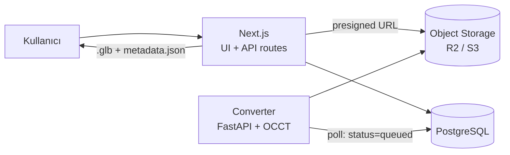

# Mimari

**Türkçe** · [English](ARCHITECTURE.en.md)

Web tabanlı CAD model yönetim platformu. Odak noktası, yüklenen CAD
dosyalarının tarayıcı üzerinde **detaylı ve gerçek CAD kalitesinde 3B
incelenmesi**; dosya paylaşımı ve katalog kısmı bunu destekleyen çerçeve.

Bu doküman tek geliştiricili, ~1 aylık bir MVP hedefine göre yazılmıştır.

---

## 1. Temel tasarım kararı

Projenin zor kısmı upload/liste/yorum değil, **STEP gibi B-rep tabanlı bir CAD
dosyasını tarayıcıda anlamlı biçimde gösterebilmek**. Bu yüzden mimarinin
merkezinde bir **dönüştürme (tessellation) servisi** var.

İki yol vardı:

| Yaklaşım | Artı | Eksi |
|---|---|---|
| **A. İstemcide WASM** (`occt-import-js`) | Kurulumu ~1 gün, ayrı servis yok | Sadece mesh + hiyerarşi + renk. Exact ölçüm, kütle özellikleri, yüzey bazlı seçim yok. Büyük dosya tarayıcı belleğini yer. |
| **B. Sunucuda OCCT** (Python + OCP) | B-rep topolojisine tam erişim: exact hacim/alan/ağırlık merkezi, kenar çizgileri, yüzey/kenar bazlı seçim ve ölçüm. Bir kez işle, herkese hafif `.glb` servis et. | Ayrı bir servis. Öğrenme eğrisi dik. |

**Seçim: B.** Ürünün ayırt edici değeri "detaylı inceleme" olduğu için,
topolojik veriye erişim vazgeçilmez. Kenar çizgileri (edge polyline) olmadan
model bir üçgen yığınına benzer; exact kütle özellikleri mesh'ten tahmin
edilemez.

---

## 2. Sistem görünümü



- **Yükleme** tarayıcıdan doğrudan object storage'a gider (presigned URL).
  Next.js üstünden geçirilmez — serverless body limitine takılır.
- **Converter** ayrı bir servistir; DB'yi `status = 'queued'` için yoklar.
  MVP'de Redis/Celery yok; DB polling yeterli ve ayıklanması çok daha kolay.
- **Viewer** yalnızca türetilmiş `.glb` ve `metadata.json` tüketir; orijinal
  CAD dosyasını asla indirmez.

---

## 3. Teknoloji stack

### Frontend / uygulama
- **Next.js 15 (App Router) + TypeScript** — UI ve CRUD API'leri tek repoda
- **React Three Fiber + drei** (three.js) — viewer
- **three-mesh-bvh** — hızlı raycast; seçim ve ölçüm bunsuz büyük modellerde takılır
- **Tailwind + shadcn/ui** — UI'a vakit harcamamak için
- **zustand** — viewer state (seçili parça, aktif araç, kesit düzlemi, patlatma oranı)

### Converter servisi
- **Python + FastAPI**. Yerel geliştirme sanal ortamda yürür; Docker imajı
  deploy içindir (aşağıdaki nota bakınız)
- **OCCT bindings**: `cadquery-ocp` (pip) — alternatif `pythonocc-core` (conda)

  > **Supabase pooler notu.** İki servis de prepared statement'ları kapatıyor
  > (postgres-js'te `prepare: false`, psycopg'de `prepare_threshold = None`).
  > Transaction pooler ardışık sorguları farklı backend oturumlarına dağıttığı
  > için, tekrarlanan bir sorguyu sessizce prepared statement'a çeviren bir
  > sürücü `prepared statement "_pg3_0" already exists` ile düşüyor — worker
  > ilk çalıştığında tam olarak bu oldu.

  > **Doğrulandı (2026-08-24).** `cadquery-ocp` 7.9.3.1.1, macOS arm64 /
  > Python 3.12 ortamına pip ile sorunsuz kuruldu; STEP yaz/oku turu, exact
  > kütle özellikleri, tessellation ve kenar çıkarma doğru sonuç verdi.
  > Docker yerel geliştirme için gerekli değil. Fly.io ve Railway imajı kendi
  > tarafında build ettiğinden deploy'da da yerel Docker'a ihtiyaç olmayabilir.
- **trimesh** — mesh formatları (STL/OBJ/PLY) için hafif yol
- Çıktı: **Draco/meshopt sıkıştırmalı `.glb`** + `metadata.json`

### Veri ve altyapı
- **PostgreSQL** (Neon veya Supabase) + **Drizzle ORM**
- **Cloudflare R2** (veya S3) — orijinal CAD, türetilmiş glb, thumbnail
- **Auth.js v5** — (sıfır efor isteniyorsa Clerk)

### Deploy
- Next.js → **Vercel**
- Converter → **GitHub Actions**, yükleme başına bir çalışma

  > **2026-08-28'de değişti.** Plan bir konteyner barındırıcısıydı ve düzenli
  > trafik için doğru cevap hâlâ o. Vercel dışında bir barındırma yoksa
  > converter'ı serverless bir fonksiyona taşımak da mümkün değil: OpenCascade
  > kurulu halde 221 MB, Vercel'in paket sınırı 250 MB. Repo public olduğu için
  > Actions dakikaları ücretsiz, ve kuyruk worker'ının nerede koştuğunu
  > umursamıyor — `FOR UPDATE SKIP LOCKED` çakışan iki CI çalışmasına da iki
  > konteynere davrandığı gibi davranır.
- Storage → **R2**

---

## 4. Veri modeli (taslak)

```sql
users(id, email, name, image, created_at)

projects(id, owner_id → users, name, slug, description,
         visibility ENUM('private','public'), created_at)

models(id, project_id → projects, name, description,
       current_version_id → model_versions, created_at)

model_versions(
  id, model_id → models, version_no,
  source_key,          -- R2: orijinal CAD dosyası
  source_format,       -- step | iges | stl | obj | glb
  source_size_bytes,
  glb_key,             -- R2: türetilmiş viewer dosyası
  metadata_key,        -- R2: metadata.json
  thumbnail_key,
  status,              -- queued | processing | ready | failed
  error_message,
  stats_json,          -- hacim, alan, bbox, ağırlık merkezi, parça/üçgen sayısı
  created_by → users, created_at
)

annotations(id, model_version_id → model_versions, author_id → users,
            body, anchor_json,   -- 3B nokta + normal + parça id
            resolved_at, created_at)

comments(id, model_id → models, author_id → users, body, created_at)

project_members(project_id, user_id, role ENUM('owner','editor','viewer'))
```

Versiyonlama `models` değil `model_versions` üzerinden yürür; bir modelin
geçmiş revizyonları viewer'da yan yana açılabilsin diye her versiyonun kendi
`.glb`'si kalıcıdır.

---

## 5. Dönüştürme pipeline

`status = 'queued'` bir `model_versions` kaydı görüldüğünde:

1. Orijinal dosyayı R2'den indir, `status = 'processing'` yap.
2. Formata göre oku:
   - **STEP / IGES** → OCCT `STEPControl_Reader` / `IGESControl_Reader`
   - **STL / OBJ / PLY** → trimesh
3. **Assembly ağacını** gez (`XCAFDoc_ShapeTool`): parça isimleri, hiyerarşi,
   renkler, transform matrisleri.
4. Her katı için:
   - `BRepMesh_IncrementalMesh` ile **tessellate** (deflection ayarlanabilir)
   - `BRepGProp` ile **exact hacim, yüzey alanı, ağırlık merkezi**
   - `Bnd_Box` ile bounding box
   - **Kenarları** eğriden örnekleyerek polyline olarak çıkar; aynı `.glb`
     içinde LINES primitive'i olarak taşınır → viewer'da `LineSegments`
   - Üçgenleri **yüzey (face) gruplarına** göre etiketle → yüzey bazlı seçim
5. Sonucu tek `.glb` olarak yaz (Draco/meshopt), `metadata.json` ile birlikte
   R2'ye yükle. Küçük bir thumbnail render'ı da burada üretilir.
6. `status = 'ready'`, `stats_json` doldurulur. Hata olursa
   `status = 'failed'` + `error_message`.

**Deflection ayarı kritik.** Sabit ve ince bir değer kullanılırsa 50 MB'lık bir
STEP'ten 300 MB'lık glb çıkar. Model bounding box'ına göre orantılı bir
deflection ve üst sınırlı bir üçgen bütçesi uygulanmalı.

  > **Ölçüldü (2026-08-28).** Ölçek iki ayrı eksen ve farklı yerleri zorluyor.
  > 11 parçalı, 82.572 üçgenli bir boji montajı: 27 sn dönüşüm, 22 çizim
  > çağrısı, M1 Pro'da 120 fps (ekranın tavanı), 20 MB GPU belleği. Sentetik
  > 500 parçalı bir montaj (157.600 üçgen): 4,8 sn dönüşüm — parçalar
  > geometrik olarak basit olduğu için daha hızlı — ama **1.000 çizim çağrısı**
  > (parça başına bir gövde, bir de kenar seti) ve 502 satırlık bir ağaç.
  > Etkileşim akıcı bildirildi; sayısını ölçmedim.
  >
  > Yani sınır üçgen sayısı değil, **parça sayısı**. Gerekirse ilk kaldıraç
  > kenar çizgilerini malzemeye göre birleştirmek: çizim çağrısını yarıya
  > indirir. Dosyayı `converter/scripts/make_large_assembly.py` üretiyor.

`metadata.json` şeması kabaca:

```json
{
  "tree": [{ "id": "n12", "name": "Bracket", "children": [], "meshIndex": 3 }],
  "parts": {
    "n12": { "volume_mm3": 12043.2, "area_mm2": 8891.0,
             "com": [12.0, 3.4, -8.1], "bbox": [[0,0,0],[40,20,10]] }
  },
  "units": "mm",
  "face_groups": { "n1_1": [[0, 240], [240, 512]] },
  "snap": {
    "n1_1": {
      "vertices": [[0, 0, 0]],
      "edges": [{ "kind": "circle", "centre": [20, 10, 30], "axis": [0, 0, 1],
                  "radius": 4.0, "length": 25.13 }],
      "faces": [{ "kind": "cylinder", "axis": [0, 0, 1], "radius": 4.0 }]
    }
  }
}
```

---

## 6. Viewer mimarisi

Tek bir `<Viewer>` R3F sahnesi, etrafında panel'ler:

- **Sahne**: glb yüklenir, `three-mesh-bvh` ile her mesh'e BVH kurulur.
  Kenar polyline'ları ayrı bir `LineSegments` katmanı olarak çizilir — CAD
  görünümünü veren şey budur.
- **Assembly ağacı paneli**: `metadata.json → tree`. Her düğümde görünürlüğü
  denetleyen bir checkbox var; alt montajın kutusu kendi durumu değil,
  çocuklarının bir görünümüdür — bazıları gizliyken kısmi görünür ve
  senkronda tutulacak ikinci bir durum olmaz. İzole, diğer her şeyi gizler.

  Aynı parçanın birden çok kez kullanıldığı kardeşler tek satırda, sayısıyla
  birlikte toplanır. Yirmi dört kez geçen bir bağlantı elemanı aksi halde
  birbirinden ayırt edilemeyen yirmi dört satır demek ve montajın geri kalanını
  ekrandan itiyor; gruplanınca ağaç montajın neyden oluştuğunu gösteriyor,
  örnekler ise tek tıkla açılıyor.
- **Seçim**: raycast → mesh + üçgen indeksi → `face_groups` ile yüzey id'si.
  Seçim durumu zustand'da; ağaç ve sahne aynı state'i paylaşır.
- **Ölçüm araçları**: nokta-nokta ölçüm, köşe > kenar > yüzey önceliğiyle
  snap. Snap hedefleri `metadata.json`'daki `snap` bloğundan gelir: köşeler
  B-rep vertex'leri, çember kenarların çapı CAD tanımından. Ekrandaki üçgen
  yalnızca *hangi* geometrinin kastedildiğine karar vermek için kullanılır.
  İki yüzey arası açı henüz yok (düzlem normalleri veride hazır).
- **Kesit düzlemi**: three.js `clippingPlanes`, eksen seçimi (X/Y/Z), model
  sınırları boyunca konum ve yön çevirme. Kesit yüzeyi **stencil ile
  kapatılır**: kapatılmazsa katı içi boş bir kabuk gibi görünür, kesit değil
  bozuk model okuması verir. Cap parça başına çizilir, böylece her parça kendi
  rengini taşır.

  Kesit yalnızca görüntülemedir; parçanın kütle özellikleri kesilmemiş katıya
  aittir. Raycast kırpma düzlemini bilmediği için hem seçim hem ölçüm snap'i
  düzlemin görünen tarafına ayrıca filtrelenir — yoksa kesilip atılmış bir
  köşeye ölçüm yapılabilirdi. Serbest (eksen dışı) düzlem henüz yok.
- **Patlatılmış görünüm**: parçaların ağırlık merkezinden dışa doğru,
  tek bir oran slider'ı ile.
- **Özellik paneli**: seçili parçanın hacim / alan / bbox / ağırlık merkezi.
- **Kamera**: orbit + view cube + standart görünümler (iso, ön, üst, sağ),
  "seçime odaklan".
- **Markup**: 3B noktaya iğnelenmiş notlar (`annotations.anchor_json`).

Koordinat sistemi: sahne **Z-up**'tır, yani CAD verisiyle aynı. Kameraya
`up = [0, 0, 1]` verilir; geometri three.js'in Y-up kabulüne döndürülmez.
Döndürülseydi özellik panelindeki her bounding box ve ağırlık merkezi,
ekrandaki nesneden farklı bir çerçevede kalırdı.

State yönetiminde kural: **sahne grafiği tek doğru kaynak değildir.** Görünürlük,
seçim ve renk zustand store'unda tutulur; R3F bileşenleri bunu okur. Aksi halde
ağaç paneli ile sahne senkronizasyonu kısa sürede bozulur.

---

## 7. Depolama düzeni

```
r2://cad-models/
  {projectId}/{modelId}/{versionId}/
    source.step          # orijinal, değişmez
    model.glb            # viewer için türetilmiş
    metadata.json
    thumb.png
```

Orijinal dosya viewer'a hiçbir zaman servis edilmez; yalnızca yetkili
kullanıcıya presigned indirme linki ile verilir.

---

## 8. API taslağı

| Yöntem | Yol | Açıklama |
|---|---|---|
| `GET` | `/api/models` | Modelleri versiyonlarıyla listeler |
| `POST` | `/api/models` | Model ve ilk versiyonu oluşturur, presigned PUT URL döner |
| `GET` | `/api/models/:id` | Tek model + versiyon listesi |
| `POST` | `/api/models/:id/versions` | Yeni revizyon, presigned PUT URL ile |
| `POST` | `/api/versions/:id/uploaded` | İstemci yüklemenin bittiğini bildirir, versiyon kuyruğa girer |
| `GET` | `/api/versions/:id/assets` | glb / metadata / thumb için presigned GET |

Her uç önce çağıranı, sonra kaynağı bir erişim kontrolünden geçirir; hiçbir
zaman yalnızca id ile değil: URL'deki model id'si bir uuid'dir, yetki belgesi
değil. Okuma hakkı olmayan çağıran `403` değil `404` alır — bir modelin var
olduğunu ama başkasına ait olduğunu doğrulamak, söylenmesi gerekenden
fazlasını söyler. En kritik kontrol `/versions/:id/assets` üzerindedir, çünkü
okuma hakkı olmayan birine imzalı indirme linki üretmek doğrudan modelin
kendisini vermek olur.

Giriş yalnızca GitHub ile. Geliştirme derlemesinde ayrıca parolasız bir yerel
giriş var; böylece taze bir klon OAuth uygulaması kaydetmeden çalışabiliyor.
`NODE_ENV` `production` olduğunda sağlayıcı listesinden çıkarılır.

Yükleme tek adım değil, üç adım. Kayıt dosyadan önce oluşturulur çünkü
yüklemenin yazacağı bir anahtara ihtiyacı var; istemci onaylayana kadar
`uploading` durumunda kalır, böylece yarım kalmış bir yükleme converter'a hiç
verilmez. Ayrı bir presign uç noktası yok: URL yalnızca ait olduğu kayıtla
birlikte üretilir, yani kimse rastgele bir anahtar için imzalı URL
isteyemez.

Arama/filtre ve markup uç noktası henüz yok.

Converter servisi dışa açık değildir; yalnızca DB ve depolama ile konuşur.
İşi `UPDATE ... WHERE id = (SELECT ... FOR UPDATE SKIP LOCKED LIMIT 1)` ile
alır — broker olmadan birden fazla worker için doğru bir kuyruk — ve zaman
aşımını geçen `processing` kayıtları kuyruğa geri koyar; çökmüş bir worker'ın
işi böyle geri gelir.

---

## 9. Kapsam dışı (MVP)

- **Native CAD formatları** — parçalar ve montajlar (`.ipt`/`.iam`,
  `.sldprt`/`.sldasm`, `.catpart`/`.catproduct`, `.prt`/`.asm`) ve teknik
  resimler (`.idw`, `.slddrw`, `.catdrawing`, `.dwg`). Her biri
  yüklemede, ne yapılması gerektiğini söyleyen bir mesajla reddedilir; native
  bir resme "kendini dışa aktar" denmez, belgelediği modeli yüklemesi söylenir —
  çünkü bir resmin dışa aktarılacak katısı yoktur. Açık kaynak
  çözümü yoktur; CAD Exchanger / HOOPS / Datakit gibi ticari SDK gerekir.
  Doğrudan okunan formatlar: **STEP, IGES, STL, OBJ, PLY, glTF/GLB** ve
  aşağıdaki koşullarla **DXF**.
- **Birden fazla görünüşten parça geri çatma.** *Tornalanmış* bir parçanın DXF
  resmi okunur (bölüm 12): tek profil, tek eksen, tek döndürme. İki görünüşün
  birbiriyle ilişkilendirilmesini gerektiren her şey — cep, yandan frezelenmiş
  basamak, çapraz delik — okunmaz; tahmin edilmez, reddedilir.
- Gerçek zamanlı çok kullanıcılı oturum (birlikte gezinme).
- PMI / GD&T anotasyonlarının okunması.
- Sunucu tarafı yüksek kaliteli render (raytrace) çıktısı.

## 10. Riskler

| Risk | Karşılık |
|---|---|
| ~~OCCT kurulumu~~ | **Elendi (2026-08-24).** Kurulum yerel ortamda doğrulandı; bölüm 3'teki nota bakınız. |
| OCCT API öğrenme eğrisi | Kalan risk. 1. haftada uçtan uca tek bir STEP dönüşümü bitmeli. |
| Dockerfile hiç build edilmedi | Hâlâ açık. Yerel geliştirme onu hiç gerektirmiyor, dolayısıyla imaj doğrulanmadı ve yazıldığı makinede Docker yok. Deploy artık ona ihtiyaç duymuyor: converter, paketi doğrudan kuran bir CI runner'ında çalışıyor. İmaj, ileride bir konteyner barındırıcısı mümkün olursa oraya geçişin yolu olarak duruyor. Konteyner artık sağlık API'si yerine worker'ı çalıştırıyor; deploy'un ihtiyacı olan bu. |
| ~~IGES hiç denenmedi~~ | **Kapandı.** Üretilmiş bir IGES fixture'ı, OCCT'nin kurulu olduğu her yerde test paketi tarafından çevriliyor — yerelde ve Docker imajında; CI işi geometri testlerini bilerek atlıyor. Geometri exact; format ürün yapısı taşımadığı için montaj tek isimsiz parça olarak geliyor. |
| Devasa STEP dosyaları | Deflection'ı bbox'a göre ölçekle, üçgen bütçesi koy, dosya boyutu üst sınırı uygula. |
| ~~Ölçüm doğruluğu~~ | **Çözüldü.** Converter `snap` bloğunu (vertex, kenar, yüzey tanımları) yayıyor; viewer ölçümü buna snap'liyor, mesh'e değil. Köşe-köşe ölçüm 40×20 plakanın köşegeninde 44.72 mm veriyor. |
| ~~Erişim kurallarının testi yok~~ | **Kapandı.** Kurallar CI'da PGlite'a karşı koşuyor; ikisini bilerek bozmanın testleri düşürdüğü doğrulandı. |
| Kapsam kayması | Katalog/sosyal özellikler (beğeni, takip, akış) MVP dışı; değer viewer'da. |

---

## 11. Yol haritası (4 hafta)

| Hafta | Hedef |
|---|---|
| 1 | İskelet: auth, DB şeması, presigned upload, converter servisi (STEP → glb + metadata), job durumu |
| 2 | Viewer çekirdeği: R3F, glb yükleme, orbit + view cube, assembly ağacı, göster/gizle/izole, kenarlar, BVH picking |
| 3 | İnceleme araçları: ölçüm, kesit düzlemi, patlatılmış görünüm, özellik paneli, ekran görüntüsü, 3B markup |
| 4 | Ürün yüzeyi: model listesi/detay, arama-filtre, versiyonlama, paylaşım/izin, deploy + tampon |

Ölçüm ve kesit araçlarının 3. haftaya bırakılması bilinçlidir: demo değerinin
çoğu oradadır, ancak viewer çekirdeği oturmadan yazılırsa iki kez yazılır.

---

## 12. Resimden okuma (`derived` geometri)

Teknik resim model değildir. Onu katıya çevirmek, izdüşümün ne anlama geldiğine
karar vermek demektir; bu yüzden bu yolla üretilen her şey
`geometry_source: "derived"` etiketiyle ve onu üreten kararlarla birlikte gelir.

Yalnızca tek tip tahmin yapılır, çünkü yapmaya değecek kadar dar olan tek tahmin
budur: tornalanmış parça, bir eksen etrafında döndürülmüş bir profildir ve resim
ikisini de gösterir.

| Adım | Yapılan | Reddedilen |
|---|---|---|
| Açıklamalar | Ölçüler, notlar, tarama, kılavuz çizgiler ve bloklar DXF varlık tipine göre atılır; kapalı, dondurulmuş ya da basılmayan katmanlardaki her şey de | — |
| Eksen | Çizgi tipi CENTER'a çözülen ya da katmanı CENTER / CENTRE / AXIS / EKSEN olan en uzun çizgi | Eksen çizgisi olmayan resim. Hiçbir şey eksen uydurmaz |
| Profil | Eksenin iki yanında da kapalı konturlar kurulur, ekseni kesenler orada kesilir; eksene yaslanan kontur seçilir | Kapanmayan kontur; tek noktada buluşan üç uç |
| Katı | `BRepPrimAPI_MakeRevol`, tam tur | Eksen çizgisini kesen yay; doğrulanmayan döndürme |

Eksenin neden asla tahmin edilmediği: eksen, parçadaki bütün çapları belirler.
Yanlış tahmin edilmiş bir eksen, bozuk olduğu belli bir model üretmez — her
yarıçapı yanlış, ikna edici bir model üretir, ve birileri onu ölçer. Neyin eksik
olduğunu söyleyen bir ret, makul görünen bir katıdan daha değerlidir.

Çıkan şey sıradan bir B-rep'tir ve öyle muamele görür: STEP dosyasıyla aynı
tessellation, aynı face_groups, aynı exact kenarlar ve snap hedefleri. Yani her
ölçüm ve kesit aracı üzerinde değişmeden çalışır. Belirsiz olan sayılar değil,
bunun doğru parça olup olmadığıdır; etiket ve kaydedilen varsayımlar bunun
içindir.

Kayıt iki listedir ve ayrı tutulur, çünkü farklı sorulara cevap verirler.
`assumptions`, okumanın verdiği kararlardır: hangi çizgi eksen sayıldı, hangi
taraf döndürüldü, kesit ne kadar. `ignored`, sayfada olup parçaya girmeyendir ve
şekil yanlış çıktığında ilk bakılacak yerdir: konturu spline olarak gelen bir
resim bunu orada söyler, başka hiçbir yerde söylemez. İkisi de viewer'ın
özellikler panelinde, her sayının üstünde gösterilir.

Görüntü değil DXF: DXF'te açıklamalar ayrı bir varlık tipidir, dolayısıyla
parçayı sayfadan ayırmak bir görüntü işleme problemi değil, bir filtredir.
Burada hiçbir şey piksel okumaz.
